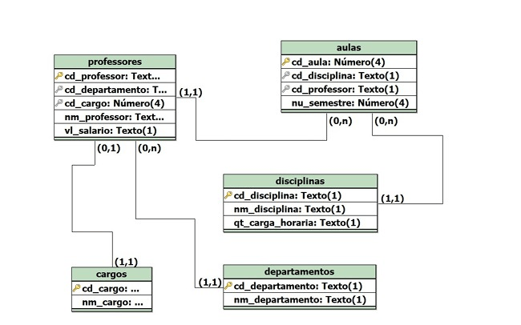
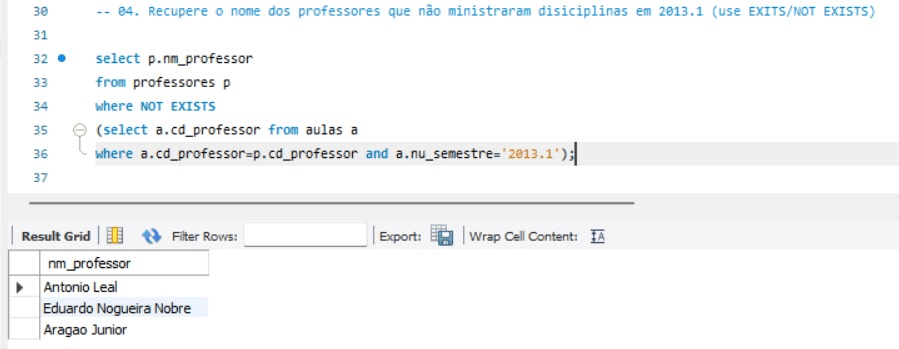
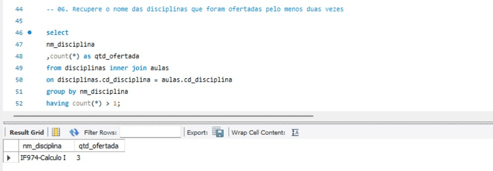
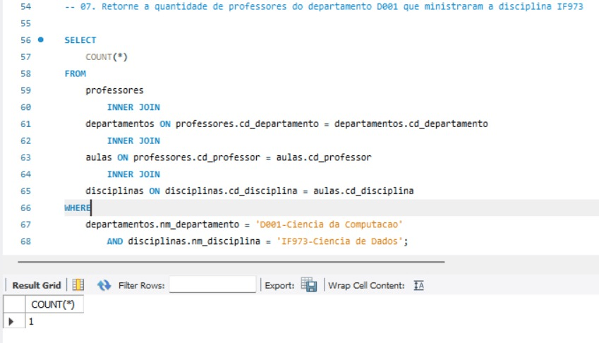

# 🎓 Sistema de Gestão Acadêmica - Banco de Dados SQL

Este projeto apresenta a modelagem e implementação de um banco de dados relacional voltado para a administração acadêmica. O foco principal é organizar departamentos, professores, cargos, disciplinas e o controle de ofertas de aulas por semestre.

---

## 🚀 Estrutura do Repositório

O projeto foi dividido em três módulos principais para seguir boas práticas no desenvolvimento SQL:

- **`01_DDL.sql`**: criação do banco de dados e das tabelas, com definição de tipos de dados, chaves primárias e restrições de integridade
- **`02_DML.sql`**: inserção de registros para popular o sistema com dados de teste
- **`03_DQL.sql`**: conjunto de consultas SQL desenvolvidas para resolver desafios reais de extração e análise de dados

---

## 📊 Modelo Lógico Relacional

O banco de dados foi estruturado para reduzir redundâncias e garantir integridade entre as entidades por meio de relacionamentos bem definidos.



---

## 🔍 Exemplos de Consultas Resolvidas

Abaixo estão alguns exemplos de consultas desenvolvidas no projeto e seus respectivos cenários de análise:

### 1. Filtro de Professores com `NOT EXISTS` (Questão 04)
**Cenário:** identificar professores que não ministraram aulas no semestre **2013.1**.  
**Técnica aplicada:** subquery correlacionada com `NOT EXISTS`.



### 2. Agrupamento e Filtro com `HAVING` (Questão 06)
**Cenário:** localizar disciplinas que foram ofertadas pelo menos duas vezes.  
**Técnica aplicada:** agregação com `COUNT` e filtragem com `HAVING`.



### 3. Junção de Múltiplas Tabelas (Questão 07)
**Cenário:** contar professores de um departamento específico que lecionaram determinada disciplina.  
**Técnica aplicada:** `INNER JOIN` entre múltiplas tabelas.



---

## 🛠️ Tecnologias e Conceitos Aplicados

- **SQL**
- **MySQL / PostgreSQL**
- **Modelagem Relacional**
- **Normalização**
- **Chaves Primárias e Estrangeiras**
- **Integridade Referencial**
- **Joins**
- **Subqueries**
- **Agregações**
- **Filtros com `HAVING` e `NOT EXISTS`**

---

## 📖 Aprendizados

Durante o desenvolvimento deste projeto foram aplicados conceitos importantes como:

- modelagem de banco de dados relacional
- normalização de tabelas
- criação de tabelas com restrições de integridade
- uso de chaves primárias e estrangeiras
- consultas com múltiplos joins
- subqueries correlacionadas
- agregações e filtros avançados em SQL

---

## 🚀 Como Executar

1. Clone este repositório na sua máquina:

```bash
git clone https://github.com/seu-usuario/nome-do-repositorio.git
```
2. Abra o projeto no seu SGBD de preferência.

3. Execute os scripts na seguinte ordem:
   1. `01_DDL.sql`
   2. `02_DML.sql`
   3. `03_DQL.sql`

## 👨‍💻 Autor

Pedro Vasconcelos de Pinho
Estudante de Ciência da Computação
